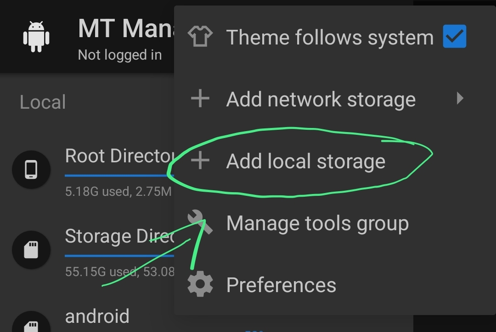

# MCBE SHADER TEMPLATE
- Making Shader Hasn't Been More Easier! 💀

## Using:
  - Materials 1.20.0
  - Data: 1.20.0
  - MBT 0.9.0 - Auto convert to 1.21 support!

# How To Use?
**Download Requirements:**
  >- [Termux](https://github.com/termux/termux-app/releases/tag/v0.118.1)
  >- [MT Manager](https://mt-manager.en.uptodown.com/android)


## **STEP 1**
- Open Termux.
- Run the following commands.
- ```sh
  pkg update
  pkg upgrade
  pkg install openjdk-17 git

## **STEP 2**
- Clone this Repository by running this command in termux.
- ```sh
  git clone
- Rename The File (Optional) by Running this command.
- ```sh
  mv McbeShaderTemp "NewName"


## **STEP 3**
- Open MT Manager.
- Allow Required Permissions.
- And Follow The Steps Show in The Pictures.


 


## **STEP 4**
- Now Navigate and Click "Termux Home"
- You Should see the "McbeShaderTemp" or the "Name You Add" inside.
- Click on it then you should see this files inside.


## **STEP 5: EDITING GUIDE**
- Open termux.
- Navigate to the folder by Running this command.
- ```sh
  cd "McbeShaderTemp"   
- or if you change the name.
- ```sh
  cd "Add The Renamed Name"     
- Run this command to make everything works.
- ```sh
  find -type f -exec chmod +x {} +
- Navigate to ``materials/`` folder, you can edit there your codes in src files.
- **Fragment Code**
 >- `RenderChunk.fragment.sc`
  >- Fragment shader code.
- **Varying Code**
 >- `RenderChunk.varying.def.sc`
  >- Varying definitions for shader.
- **Vertex Code**
 >- `RenderChunk.vertex.sc`
  >- Vertex shader code.
- **Compile Method:**
- ```sh
  ./compile.sh -m "materials" -p "platforms"
- if ``-m`` is unspecified it will build all the materials
- if ``-p`` is unspecified it will build for Android.
- The finished Project or the compiled materials will be saved on ``SHADERS/`` folder.

## **Example**
- Lets Take the RenderChunk as and example.
- so after you edited the codes in RenderChunk and i want to build it in Android.
- Run this command in termux.
- ```sh
  ./compile.sh -m RenderChunk
- If i want it to build on iOS run this.
- ```sh
  ./compile.sh -m RenderChunk -p iOS
- After Running the compiled Materials will be saved on ``SHADERS`` folder.
- **If you get an errors make sure you're codes is right! and check the errors.**

## Credits:
- [ddf8196](https://github.com/ddf8196)
- [devendrn](https://github.com/devendrn)
- [SurvivalApparatusCommunication](https://github.com/SurvivalApparatusCommunication)
